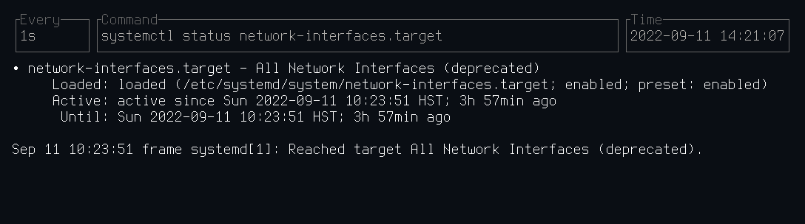

# [Intuitive] Examples

This crate is a set of examples of basic TUI applications using Intuitive.
They are run using `cargo run --example <name> -- [args]`.

## Examples
- [Watch]

### Watch
Runs a program periodically, showing its output. The TUI is inspired by [viddy].
Press `q` to quit. Example:
```bash
cargo run --example watch -- -n 1 'systemctl status network-interfaces.target'
```


[Intuitive]: https://github.com/enricozb/intuitive
[viddy]: https://github.com/sachaos/viddy
[Watch]: #watch
